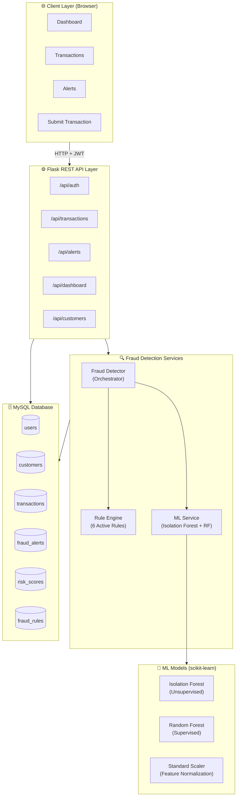
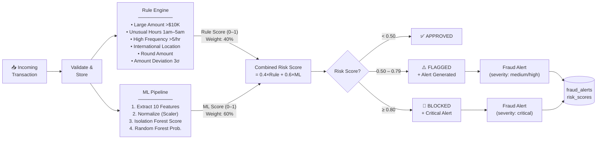
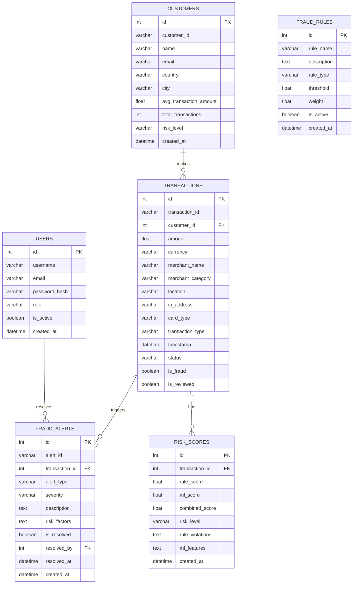

# 🛡️ AI Fraud Detection System

A full-stack, real-time financial fraud detection platform built with Python (Flask), MySQL, and Machine Learning. Combines rule-based heuristics with an Isolation Forest + Random Forest ensemble to score, flag, and alert on suspicious transactions.

---

## 📐 System Architecture



---

## 🔄 Fraud Detection Flow



---

## 🗃️ Database Schema



---

## 🧠 ML Feature Engineering

| # | Feature | Description |
|---|---------|-------------|
| 1 | `amount` | Raw transaction amount |
| 2 | `hour` | Hour of day (0–23) |
| 3 | `day_of_week` | Day of week (0=Mon) |
| 4 | `is_international` | Location ≠ customer country |
| 5 | `is_unusual_hour` | Between 1am–5am |
| 6 | `recent_count` | Transactions in last hour |
| 7 | `amount_deviation` | Z-score from customer avg |
| 8 | `is_round_amount` | Amount is whole number |
| 9 | `is_high_risk_cat` | Gambling / Crypto / Transfer |
| 10 | `customer_risk_level` | Customer flagged as high-risk |

---

## 🚦 Fraud Rules Engine

| Rule | Trigger | Weight |
|------|---------|--------|
| `LARGE_AMOUNT` | Amount > $10,000 | 35% |
| `HIGH_FREQUENCY` | > 5 transactions/hour | 30% |
| `INTERNATIONAL_TRANSACTION` | Location ≠ home country | 25% |
| `AMOUNT_DEVIATION` | 3× above customer average | 25% |
| `UNUSUAL_HOURS` | Transaction at 1am–5am | 20% |
| `ROUND_AMOUNT` | Round number > $1,000 | 15% |
| `RAPID_TRANSACTIONS` | 3+ transactions in 5 min | 25% |
| `HIGH_RISK_MERCHANT` | Gambling / Crypto / Adult | 20% |

---

## 📁 Project Structure

```
AI_FD/
├── app/
│   ├── __init__.py              # Flask app factory
│   ├── models/
│   │   └── models.py            # SQLAlchemy ORM models (6 tables)
│   ├── services/
│   │   ├── rule_engine.py       # Rule-based fraud detection
│   │   ├── ml_service.py        # ML model inference service
│   │   └── fraud_detector.py    # Detection orchestrator
│   ├── api/
│   │   ├── auth.py              # POST /api/auth/login
│   │   ├── transactions.py      # GET/POST /api/transactions
│   │   ├── alerts.py            # GET/PUT  /api/alerts
│   │   ├── dashboard.py         # GET /api/dashboard/stats
│   │   └── customers.py         # GET /api/customers
│   ├── templates/
│   │   └── index.html           # Single-page frontend (SPA)
│   └── static/
│       ├── css/style.css
│       └── js/app.js
├── ml/
│   ├── train_model.py           # Model training script
│   └── models/                  # Saved .pkl model files
│       ├── fraud_model.pkl      # Isolation Forest
│       ├── rf_classifier.pkl    # Random Forest
│       └── scaler.pkl           # StandardScaler
├── config.py                    # App + DB + ML configuration
├── setup_db.py                  # DB init + seed + model training
├── simulate.py                  # Live transaction simulator
├── run.py                       # App entry point
└── requirements.txt
```

---

## 🚀 Quick Start

```bash
# 1. Install dependencies
pip install -r requirements.txt

# 2. Setup database, seed data, and train ML models (~1-2 min)
python setup_db.py

# 3. Start the server
python run.py

# 4. Open http://localhost:5000
#    Login: admin / admin123

# 5. (Optional) Simulate live transactions in a second terminal
python simulate.py --count 30 --fraud-rate 0.4
```

---

## 🔌 REST API Reference

| Method | Endpoint | Description |
|--------|----------|-------------|
| `POST` | `/api/auth/login` | Authenticate, receive JWT token |
| `GET` | `/api/auth/me` | Get current user profile |
| `GET` | `/api/transactions` | List transactions (paginated, filterable) |
| `POST` | `/api/transactions` | Submit & analyze a new transaction |
| `PUT` | `/api/transactions/:id/review` | Mark transaction as reviewed |
| `GET` | `/api/alerts` | List fraud alerts (filterable by severity) |
| `PUT` | `/api/alerts/:id/resolve` | Resolve a fraud alert |
| `GET` | `/api/alerts/stats` | Alert counts by severity |
| `GET` | `/api/dashboard/stats` | Main KPI statistics |
| `GET` | `/api/dashboard/transactions/trend` | 7-day transaction trend |
| `GET` | `/api/dashboard/risk-distribution` | Risk score distribution |
| `GET` | `/api/dashboard/top-alerts` | Top 10 unresolved alerts |
| `GET` | `/api/customers` | List customers |

---

## 🛠️ Tech Stack

| Layer | Technology |
|-------|-----------|
| **Backend** | Python 3.13, Flask 3.0 |
| **ORM** | Flask-SQLAlchemy 3.1 + SQLAlchemy 2.0 |
| **Database** | MySQL 8.0 (via PyMySQL) |
| **Authentication** | Flask-JWT-Extended (JWT Bearer tokens) |
| **ML Models** | scikit-learn (Isolation Forest + Random Forest) |
| **Data Processing** | NumPy, Pandas |
| **Frontend** | HTML5, Bootstrap 5, Chart.js, Vanilla JS |
| **CORS** | Flask-CORS |

---

## 👤 Default Credentials

| Role | Username | Password |
|------|----------|----------|
| Admin | `admin` | `admin123` |
| Analyst | `analyst` | `analyst123` |
